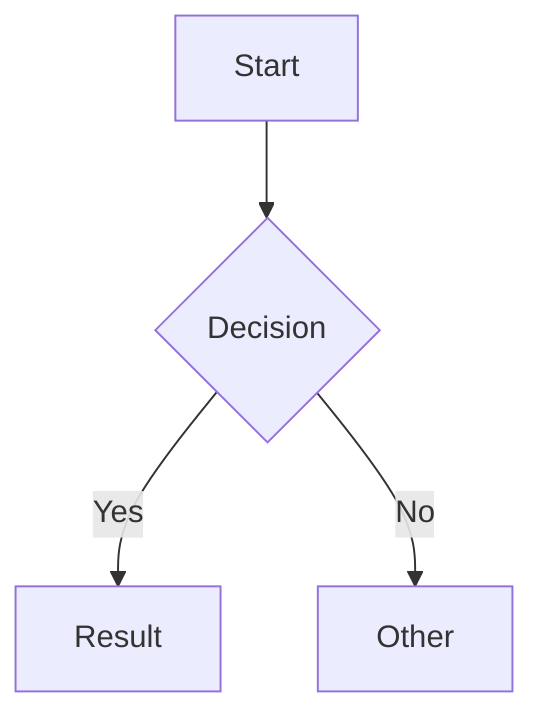

# Obsidian Flavored Markdown

Use this skill when creating or editing `.md` files in an Obsidian vault. Obsidian extends standard Markdown with internal linking, content embedding, callouts, and YAML frontmatter.

## Syntax Reference

### Internal Links (Wikilinks)

```
[[Note Name]]                    link to a note
[[Note Name|Display Text]]       custom display text
[[Note Name#Heading]]            link to a heading
[[Note Name#^block-id]]          link to a block
![[Note Name]]                   embed a note inline
![[image.png]]                   embed an image
![[file.pdf]]                    embed a PDF
```

### Callouts

```markdown
> [!note]
> Default callout for general information.

> [!warning] Custom Title
> A collapsible callout.

> [!tip]- Collapsed by default
> Use `-` after the type to collapse.
```

Common types: `note`, `info`, `tip`, `warning`, `danger`, `example`, `quote`, `abstract`, `success`, `question`, `failure`, `bug`, `todo`.

### Frontmatter Properties

```yaml
---
title: My Note
date: 2024-01-01
tags:
  - project
  - work
status: active
cssclasses:
  - wide-page
---
```

Property types Obsidian recognizes: `text`, `number`, `checkbox`, `date`, `datetime`, `list`.

### Tags

```
#tag
#nested/tag
```

### Comments (hidden in reading view)

```
%% This text is hidden %%
```

### Math (LaTeX)

```
Inline: $E = mc^2$

Block:
$$
\sum_{i=1}^{n} x_i
$$
```

### Diagrams (Mermaid)

````

````

### Footnotes

```
Here is a footnote reference[^1].

[^1]: Here is the footnote content.
```

## Workflow

1. Add frontmatter properties first (title, date, tags, status)
2. Write content using standard Markdown and Obsidian-specific syntax
3. Link related notes with `[[wikilinks]]`
4. Embed external content with `![[embeds]]`
5. Use callouts to highlight important sections
6. Verify rendering in Obsidian's reading view

## Example

```markdown
---
title: Project Planning
date: 2024-01-15
tags:
  - project
  - planning
status: active
---

# Project Planning

## Overview

This project connects to [[Team Goals]] and depends on [[Resource List]].

![[architecture-diagram.png]]

> [!warning] Deadline
> Final delivery is 2024-03-01. See [[Milestones]].

## Tasks

- [x] Define scope
- [ ] Assign owners
- [ ] Set timeline

## Notes

Related: [[Previous Project]], [[Stakeholder Map#Contacts]]
```
